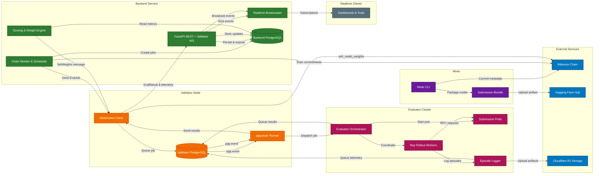

# Introduction

Kinitro links miners, validators, evaluators, and external infrastructure to deliver verifiable scores for embodied AI submissions. Miners publish models and commit them on-chain, the backend turns those commitments into evaluation jobs, validators coordinate execution, and result streams feed back into the system in real time.

## Platform Flow
1. **Submission** – A miner uploads an agent to Hugging Face and publishes the commitment on the Bittensor chain.
2. **Ingestion** – The backend monitors the chain, records new submissions, and schedules evaluation jobs.
3. **Distribution** – Validators connect to the backend over WebSocket, receive jobs, and persist them to a durable queue.
4. **Evaluation** – The evaluator orchestrator pulls queued jobs, spins up submission containers, runs Ray rollout workers, and logs every episode.
5. **Results & Incentives** – Validators forward metrics back to the backend, which stores them, emits realtime updates, and computes miner scores for weight broadcasts.

## System Architecture

## Component Responsibilities

**Backend Service**
- **FastAPI REST / Admin**: Hosts competition CRUD, submission views, stats, validator management, and WebSocket endpoints (`src/backend/endpoints.py`).
- **Chain Monitor & Scheduler**: Tracks Bittensor commitments, turns them into `BackendEvaluationJob` records, and watches for stale jobs (`src/backend/service.py`).
- **Realtime Broadcaster**: Manages client subscriptions and pushes structured events such as job updates, episode completions, and live stats (`src/backend/realtime.py`).
- **Scoring & Weight Engine**: Periodically recalculates miner scores and pushes weight updates back to validators for on-chain emission.
- **Backend PostgreSQL**: Source of truth for competitions, submissions, jobs, job status, results, stats, and validator connections (`src/backend/models.py`).

**Validator Node**
- **WebSocket Client**: Authenticates with the backend, receives `EvalJobMessage` payloads, and streams results back (`src/validator/websocket_validator.py`).
- **pgqueuer Runner**: Persists jobs/results/episode logs in PostgreSQL so work survives restarts and can be retried (`src/validator/websocket_validator.py`).
- **Validator PostgreSQL**: Stores pgq queues plus normalized tables for jobs, results, and metrics consumed by the evaluator (`src/validator/db`).

**Evaluator Cluster**
- **Evaluator Orchestrator**: Listens to the pgqueuer queue, enforces concurrency caps, and coordinates job lifecycles (`src/evaluator/orchestrator.py`).
- **Submission Pods**: Kubernetes pods created per submission to run miner containers in isolation (`src/evaluator/containers`).
- **Ray Rollout Workers**: Execute benchmark episodes, communicate with submission pods via RPC, and track success metrics (`src/evaluator/rollout`).
- **Episode Logger**: Captures per-episode and per-step data, uploads media to R2, and enqueues telemetry for validator forwarding (`src/evaluator/rollout/episode_logger.py`).

**Miner Tooling**
- **Miner CLI**: Packages models, uploads to Hugging Face, and notarizes commitments on-chain so the backend can discover them (`src/miner/__main__.py`).

**Real-time Clients**
- Subscribe to the backend’s public WebSocket endpoint to monitor competitions, validator connectivity, and evaluation progress live (`src/core/messages.py`).

## Next Steps
- Dive into the [Validator architecture notes](orchestrator.md) to see how the queue, database, and message formats interact.
- Review the [Evaluator internals](evaluator.md) for details on Ray workers, RPC bridges, and logging pipelines.
- Check the [Incentive mechanism](incentive.md) to understand how scores flow into weight updates.
