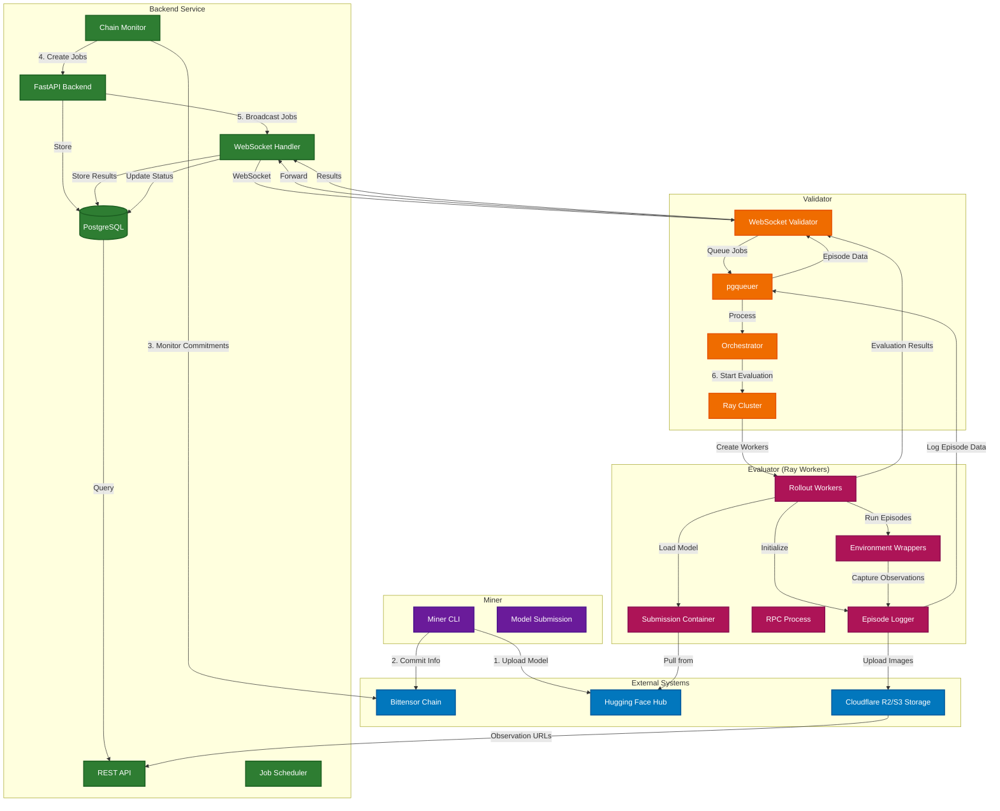

# Introduction

## How it works

1. **Define**: Competitions are posted on the Kinitro platform, each with their own set of tasks
2. **Compete**: Miners train and submit agents.
3. **Validate & reward**: Validators evaluate the agents, and the best miners earn rewards.

## Architecture Overview

Kinitro consists of three main components working together to create an incentivized evaluation platform:

### Component Responsibilities

**Backend Service**
- **FastAPI Backend**: REST API endpoints and WebSocket management
- **Chain Monitor**: Monitors Bittensor chain for miner commitments  
- **Job Scheduler**: Creates and distributes evaluation jobs
- **WebSocket Handler**: Real-time communication with validators
- **PostgreSQL**: Stores competitions, jobs, results, episode data

**Validator** 
- **WebSocket Validator**: Connects to backend, receives jobs
- **pgqueuer**: Asynchronous message processing for episode data
- **Orchestrator**: Manages evaluation lifecycle using Ray
- **Ray Cluster**: Distributed computing for parallel evaluations

**Evaluator (Ray Workers)**
- **Rollout Workers**: Execute agent episodes in environments
- **Episode Logger**: Records episode data and observations  
- **Environment Wrappers**: MetaWorld/Gymnasium integration
- **RPC Process**: Communication with agent containers
- **Submission Containers**: Isolated model execution environments
