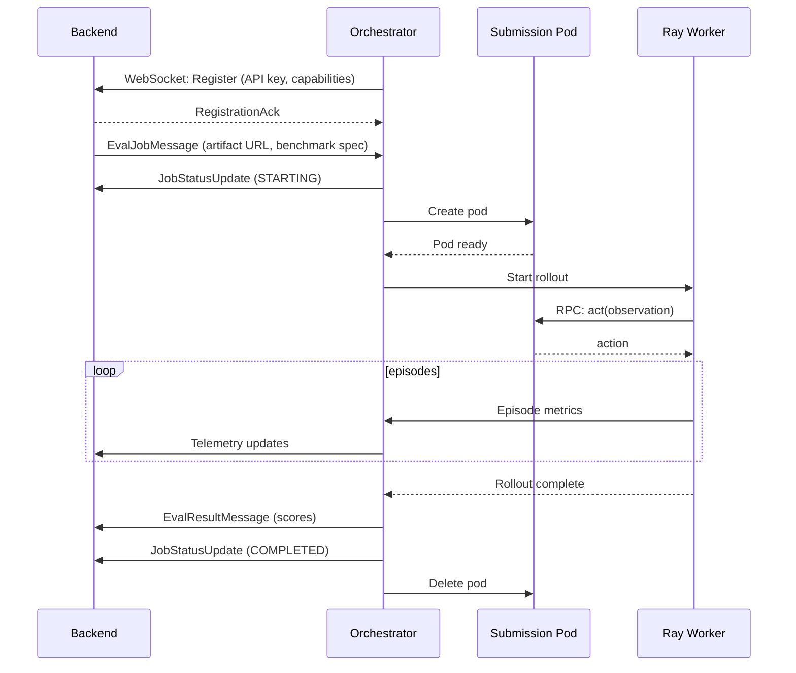

# Orchestrator

The orchestrator is the control plane that turns evaluation jobs into running rollouts. It connects directly to the backend via WebSocket, receives job assignments, provisions isolated containers which run agents, wires up Ray workers, and streams results back to the backend.

## Responsibilities

- **Backend connection** – Maintains a persistent WebSocket connection to the backend's `/ws/evaluator` endpoint. Authenticates with an API key and receives job broadcasts.
- **Concurrency control** – Tracks active jobs and defers new work until there is capacity.
- **Environment provisioning** – Spins up Kubernetes pods that host the miner submission and expose an RPC endpoint for workers.
- **Worker orchestration** – Creates Ray rollout workers, attaches benchmark specs, and streams observations and other metrics back.
- **Result streaming** – Sends `EvalResultMessage` and `JobStatusUpdateMessage` payloads directly to the backend as work completes.
- **Cleanup & recovery** – Tears down pods, closes connections, and reclaims Ray resources even on failure.

## Job Lifecycle

1. The backend broadcasts an `EvalJobMessage` to all connected evaluators via WebSocket.
2. The orchestrator receives the job and records it locally with `EvaluationStatus.STARTING`.
3. A submission container is created via the `Containers` helper, exposing a service the worker can reach over TCP.
4. A `RolloutCluster` worker runs the benchmark episodes, talking to the submission container through an RPC bridge.
5. Episode-level and step-level telemetry is captured by the `EpisodeLogger` and streamed back to the backend.
6. When the rollout completes, the orchestrator sends an `EvalResultMessage` with scores and aggregates.
7. Cleanup routines ensure pods are removed, Ray actors stopped, and resources reclaimed.

## Communication Flow

## Resilience Features

- **Automatic reconnection** – If the WebSocket connection drops, the orchestrator reconnects with exponential backoff.
- **Job recovery** – Jobs in progress when a disconnect occurs can be resumed or re-queued by the backend.
- **Timeout handling** – The orchestrator checks elapsed time per job and can mark stale work for cleanup.
- **Health monitoring** – Background tasks watch running jobs for completion or timeout signals and remove them when necessary.

## Configuration Highlights

Key settings in `evaluator.toml`:

- `backend_url` – WebSocket URL for the backend (e.g., `wss://api.kinitro.ai/ws/evaluator`).
- `api_key` – Authentication key for the evaluator.
- `max_concurrent_jobs` – Maximum number of parallel evaluations.
- `ray_num_cpus`, `ray_num_gpus`, `ray_memory_gb` – Ray head resources.
- `worker_num_cpus`, `worker_num_gpus`, `worker_memory_gb` – Per-worker resource requests.

Refer to the [Evaluator internals](evaluator.md) for details on the worker side of this pipeline.
