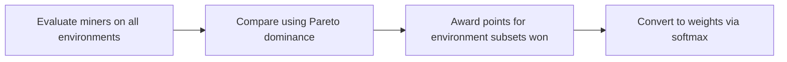
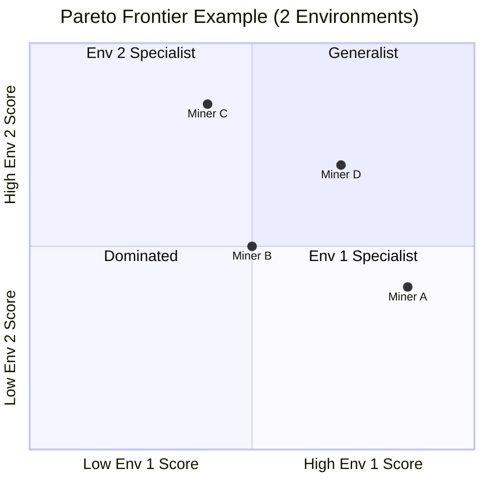
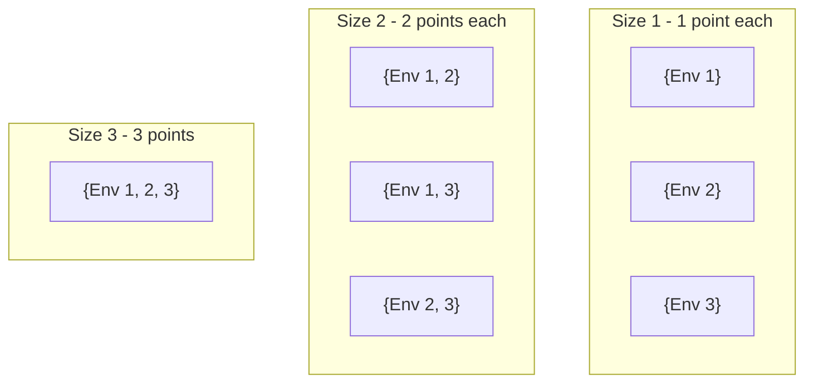

# Scoring and Incentive Mechanism

The Kinitro subnet rewards **generalist policies** that perform well across all environments, not specialists that excel at just one.

## How It Works

### 1. Evaluation

Each miner is tested on every environment with multiple episodes. Results are aggregated into **success rates**:

|         | Env 1 | Env 2 | Env 3 |
|---------|-------|-------|-------|
| Miner A | 85%   | 70%   | 75%   |
| Miner B | 60%   | 90%   | 65%   |
| Miner C | 70%   | 70%   | 70%   |

### 2. Pareto Dominance

Miner A **dominates** Miner B if A is at least as good on every environment AND strictly better on at least one.

In this example:
- **Miners A, C, D** are on the Pareto frontier (no one dominates them)
- **Miner B** is dominated by Miner D (D is better on both environments)

To account for statistical noise, we use **epsilon (ε) tolerance** - small differences within ε are treated as ties. This prevents lucky runs from determining winners.

### 3. Subset Scoring

For every combination of environments, we find who dominates that subset and award points. **Larger subsets are worth more points.**

A miner who dominates across all environments wins the most valuable subsets.

### 4. Weight Conversion

Points are converted to weights using softmax, then submitted to the chain for emission distribution.

## Why Gaming Doesn't Work

| Attack | Why It Fails |
|--------|--------------|
| **Sybil** (multiple accounts with same policy) | Identical scores = ties. No one wins any subset. |
| **Copying** the leader | You tie with them. Must *improve* to dominate. |
| **Specializing** in one environment | You only win small subsets. Generalists win the larger, more valuable ones. |

## Key Insight

The only way to earn rewards is to build a genuinely better generalist policy. Ties earn nothing, copies tie, and specialists lose to generalists.

## Configuration

| Parameter | Default | Description |
|-----------|---------|-------------|
| `episodes_per_env` | 50 | Evaluation episodes per environment |
| `pareto_temperature` | 1.0 | Softmax sharpness (lower = more winner-take-all) |
| `min_epsilon` | 0.01 | Minimum dominance threshold (1%) |
| `max_epsilon` | 0.20 | Maximum dominance threshold (20%) |

## Further Reading

For implementation details, see:
- `kinitro/scoring/pareto.py` - Epsilon-Pareto dominance
- `kinitro/scoring/winners_take_all.py` - Subset scoring
- `kinitro/scheduler/scoring.py` - Score aggregation
