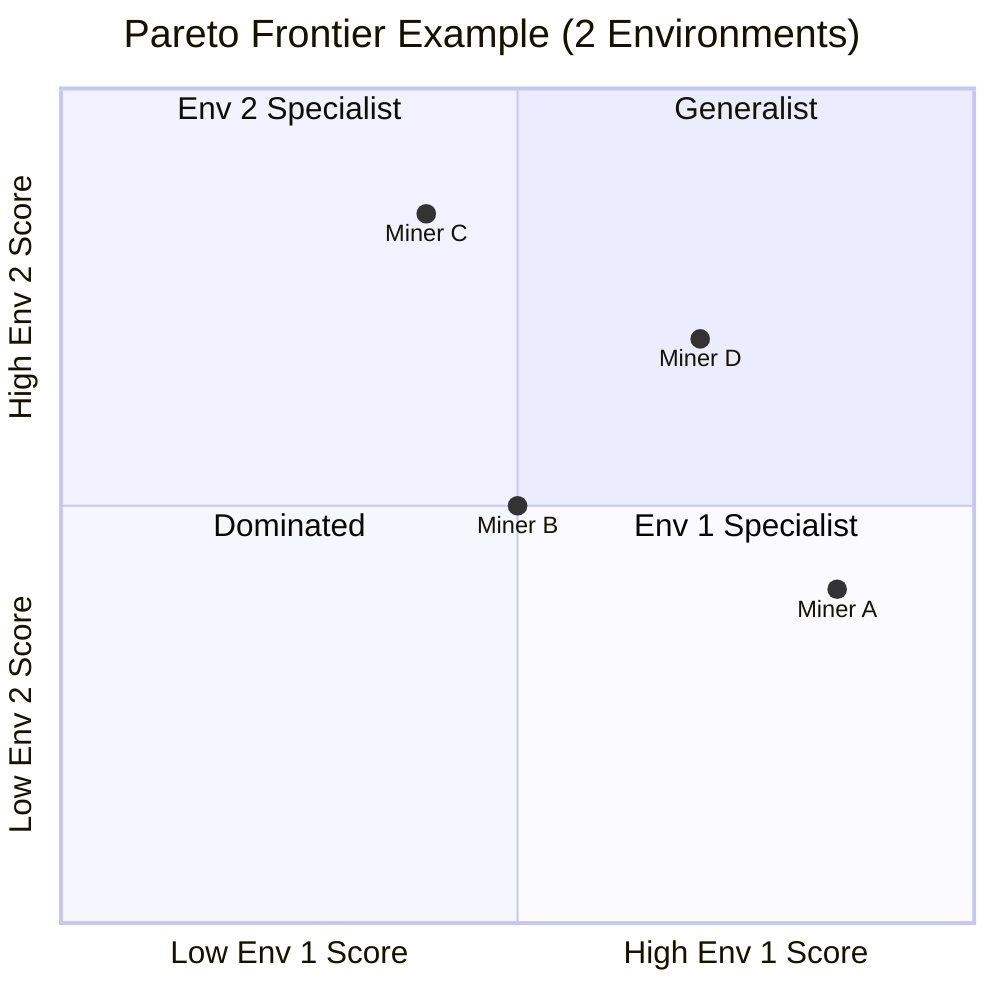
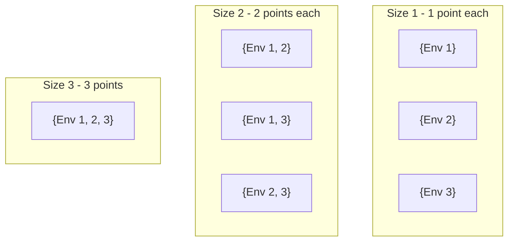

# Scoring and Incentive Mechanism

The Kinitro subnet rewards *generalist policies* that perform well across all environments, not specialists that excel at just one.

## How It Works

There are four key steps to scoring:

1. Evaluation of miners on all environments
2. Comparing evaluation results using Pareto dominance
3. Awarding points for environment subsets won (with first-commit advantage)
4. Conversion of evaluation points to weights on chain

### 1. Evaluation

Each miner is tested on every environment with multiple episodes. Results are aggregated into *success rates* for each environment. As an example:

|         | Env 1 | Env 2 | Env 3 |
| ------- | ----- | ----- | ----- |
| Miner A | 85%   | 70%   | 75%   |
| Miner B | 60%   | 90%   | 65%   |
| Miner C | 70%   | 70%   | 70%   |

### 2. Pareto Dominance

Miner A *dominates* Miner B if A is at least as good on every environment *and* strictly better on at least one.

In this example:

- **Miners A, C, D** are on the Pareto frontier (no one dominates them)
- **Miner B** is dominated by Miner D (D is better on both environments)

To account for statistical noise, we use *epsilon (ε) tolerance* — small differences within ε are treated as ties. This prevents lucky runs from determining winners.

### 3. Subset Scoring

Pareto dominance alone isn't enough to determine rewards. In the diagram above, Miners A, C, and D are all on the frontier and none dominates another. How do we decide who gets paid?

We use *subset scoring*: instead of only checking dominance across *all* environments, we check every possible *subset* of environments. For each subset, if a miner dominates all others on those environments, they win points equal to the subset size.

**Example**: Consider a specialist (95% on Env 1, 40% elsewhere) vs a generalist (70% on all):

| Subset (Env) | Winner              | Points                           |
| ------------ | ------------------- | -------------------------------- |
| {1}          | Specialist          | 1                                |
| {2}          | Generalist          | 1                                |
| {3}          | Generalist          | 1                                |
| {1, 2}       | Neither (trade-off) | 0                                |
| {1, 3}       | Neither (trade-off) | 0                                |
| {2, 3}       | Generalist          | 2                                |
| {1, 2, 3}    | Neither (trade-off) | 0                                |
| **Total**    |                     | **Specialist: 1, Generalist: 4** |

The specialist only wins the single-environment subset where they excel. The generalist wins multiple subsets because they're consistently good.

#### First-Commit Advantage

When two miners have similar scores on a subset, who wins? The miner who committed their policy first gets priority.

A later miner must beat the earlier miner's score by a *threshold gap* on *all* environments in the subset to win. This gap scales with standard error—more evaluation samples means a smaller required gap.

| Samples | Typical Gap |
| ------- | ----------- |
| 50      | 10% (max)   |
| 100     | ~7.5%       |
| 500     | ~3.4%       |

*These values assume default parameters: `threshold_z_score=1.5`, `threshold_min_gap=0.02`, `threshold_max_gap=0.10`. Different parameter values will change the gap.*

This prevents *griefing attacks* where someone copies the leader just to force a tie and deny them rewards. If you copy, you tie on score but lose on commit time.

### 4. Weight Conversion

Points are converted to weights using softmax, then submitted to the chain for emission distribution.

## Anti-gaming Properties

| Attack                                         | Why It Fails                                                                                |
| ---------------------------------------------- | ------------------------------------------------------------------------------------------- |
| **Sybil** (multiple accounts with same policy) | Identical scores = ties. The earliest account wins; later copies get nothing.               |
| **Copying** the leader                         | You tie on score but lose on time. Must beat their score + threshold gap to take the lead.  |
| **Griefing** (copy to deny rewards)            | First-commit advantage means the original miner still wins ties.                            |
| **Specializing** in one environment            | You only win small subsets. Generalists win the larger, more valuable ones.                 |

## Relevant Parameters

| Parameter            | Default | Description                                          |
| -------------------- | ------- | ---------------------------------------------------- |
| `episodes_per_env`   | 50      | Evaluation episodes per environment                  |
| `pareto_temperature` | 1.0     | Softmax sharpness (lower = more winner-take-all)     |
| `min_epsilon`        | 0.01    | Minimum dominance threshold (1%)                     |
| `max_epsilon`        | 0.20    | Maximum dominance threshold (20%)                    |
| `threshold_z_score`  | 1.5     | Z-score for first-commit threshold calculation       |
| `threshold_min_gap`  | 0.02    | Minimum gap to beat earlier miner (2%)               |
| `threshold_max_gap`  | 0.10    | Maximum gap to beat earlier miner (10%)              |

## Further Reading

For implementation details, see:

- `kinitro/scoring/pareto.py`: Epsilon-Pareto dominance
- `kinitro/scoring/threshold.py`: First-commit advantage thresholds
- `kinitro/scoring/winners_take_all.py`: Subset scoring
- `kinitro/scheduler/scoring.py`: Score aggregation
