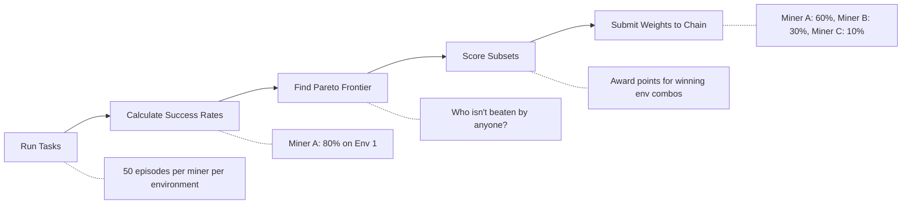
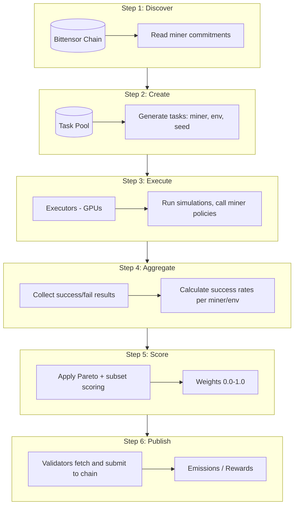
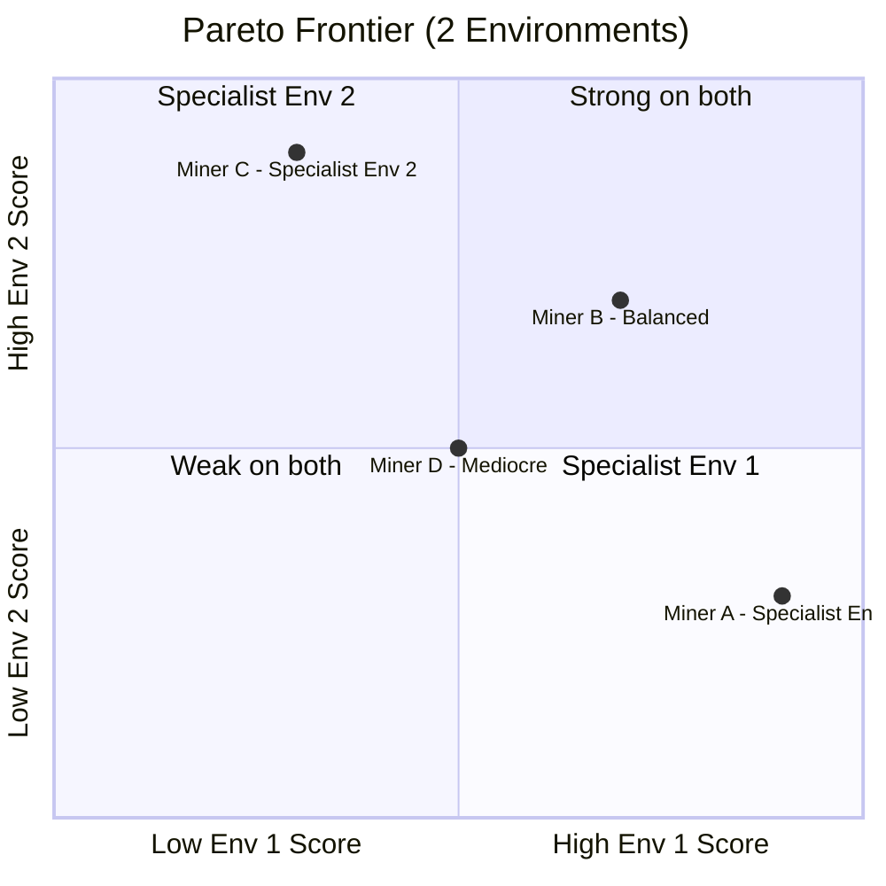

# Scoring and Incentive Mechanism

This document explains how miners are scored and rewarded in the Kinitro subnet. The system is designed to reward **generalist robotics policies** - AI models that perform well across many different tasks, not just one.

## Table of Contents

1. [The Big Picture](#the-big-picture)
2. [How Evaluation Works](#how-evaluation-works)
3. [Understanding Scores](#understanding-scores)
4. [Pareto Dominance Explained](#pareto-dominance-explained)
5. [The Subset Scoring System](#the-subset-scoring-system)
6. [Converting Scores to Weights](#converting-scores-to-weights)
7. [Why Gaming Doesn't Work](#why-gaming-doesnt-work)
8. [Configuration Reference](#configuration-reference)
9. [Technical Details](#technical-details)

---

## The Big Picture

The scoring pipeline flows from evaluation to rewards in five stages:



**The core idea**: You can't just be good at one thing. You need to be good at EVERYTHING to earn the most rewards.

---

## How Evaluation Works

### The Evaluation Cycle

Every hour (by default), the system runs a complete evaluation cycle:



For each miner and each environment, we create **50 evaluation episodes**. Each episode results in either SUCCESS (1) or FAILURE (0).

---

## Understanding Scores

### From Tasks to Success Rates

After running all episodes, we calculate how often each miner succeeded:

| Miner | Raw Results (50 episodes) | Success Rate |
|-------|---------------------------|--------------|
| Miner A | 43 successes, 7 failures | 86% |
| Miner B | 30 successes, 20 failures | 60% |
| Miner C | 35 successes, 15 failures | 70% |

### The Score Matrix

All scores are organized into a matrix where rows are miners and columns are environments:

|         | Env 1 | Env 2 | Env 3 | Env 4 |
|---------|-------|-------|-------|-------|
| Miner A | 0.85  | 0.70  | 0.60  | 0.75  |
| Miner B | 0.60  | 0.90  | 0.55  | 0.80  |
| Miner C | 0.70  | 0.70  | 0.70  | 0.70  |

**Question**: Who should get the most rewards?

- **Miner A**: Best at Env 1, decent elsewhere
- **Miner B**: Best at Env 2 & Env 4, weak at others
- **Miner C**: Consistent across all tasks

**Answer**: It depends on WHO DOMINATES WHOM...

---

## Pareto Dominance Explained

### What Does "Dominate" Mean?

Think of it like comparing athletes in a decathlon. Athlete A "dominates" Athlete B if:
1. A is **at least as good** as B in EVERY event
2. A is **strictly better** in at least ONE event

#### Example 1: Clear Dominance

|       | Env 1 | Env 2 | Env 3 | Result |
|-------|-------|-------|-------|--------|
| Alice | 90%   | 85%   | 80%   | **Alice dominates Bob** |
| Bob   | 70%   | 65%   | 60%   | (Alice is better on ALL environments) |

#### Example 2: No Dominance (Trade-off)

|       | Env 1 | Env 2 | Result |
|-------|-------|-------|--------|
| Alice | 90%   | 50%   | **Neither dominates!** |
| Bob   | 50%   | 90%   | Alice better at Env 1, Bob better at Env 2 |

#### Example 3: Tie (Identical Scores)

|       | Env 1 | Env 2 | Result |
|-------|-------|-------|--------|
| Alice | 80%   | 80%   | **Neither dominates!** |
| Bob   | 80%   | 80%   | They're exactly the same |

### The Epsilon (ε) Tolerance

Here's the problem: if Alice scores 80.1% and Bob scores 80.0%, is Alice really better? With only 50 trials, that difference could just be luck.

**Solution**: We add a tolerance called epsilon (ε). Small differences are treated as ties.

| Scenario | Without Epsilon | With Epsilon (ε = 5%) |
|----------|-----------------|----------------------|
| Alice: 82%, Bob: 80% | Alice wins? (maybe luck) | **TIE** (within ε) |
| Alice: 90%, Bob: 75% | Alice wins | **Alice wins** (beyond ε) |

> **The Epsilon Rule**
> 
> To DOMINATE, you must be better by MORE than ε on at least one environment, and not worse by more than ε on any environment.
> 
> - "Strictly better" means: `Score_A > Score_B + ε`
> - "Not worse" means: `Score_A >= Score_B - ε`

### How Epsilon is Calculated

Epsilon adapts based on the variance in scores:

```
                   Standard Deviation of Scores
Epsilon (ε) = 2 × ─────────────────────────────────
                   √(Number of Episodes)
```

**Example:**
- Scores for an environment: [0.85, 0.60, 0.70, 0.75, 0.80]
- Standard Deviation = 0.09
- Number of Episodes = 50
- ε = 2 × (0.09 / √50) = 2 × 0.013 = **0.026 (2.6%)**

**Bounds:**
- Minimum ε = 1% (always require at least 1% difference)
- Maximum ε = 20% (cap the tolerance)

**Intuition:**
- More episodes → Lower ε → Finer distinctions possible
- Higher variance → Higher ε → More conservative comparisons

### The Pareto Frontier

The "Pareto Frontier" is the set of miners that aren't dominated by anyone.



- **On the Frontier**: Miners A, B, and C (not dominated by anyone)
- **Dominated**: Miner D (Miner B is better on BOTH dimensions)

The frontier represents the best trade-offs. Miner D is dominated by Miner B because B scores higher on both Env 1 (70% vs 50%) and Env 2 (70% vs 50%).

---

## The Subset Scoring System

Being on the Pareto frontier isn't enough. We use "subset scoring" to determine final rewards.

### The Idea

We look at every possible combination of environments and ask: "Who wins this combo?"

With 3 environments {A, B, C}, there are **7 possible subsets**:

| Subset Size | Subsets | Points Each |
|-------------|---------|-------------|
| Size 1 | {A}, {B}, {C} | 1 point |
| Size 2 | {A,B}, {A,C}, {B,C} | 2 points |
| Size 3 | {A,B,C} | 3 points |

**Total possible points**: 1+1+1 + 2+2+2 + 3 = **12 points**

> **Key Insight**: Bigger subsets = More points. Being good at EVERYTHING pays off!

### How Winners Are Determined

For each subset, we find who dominates everyone else ON THAT SUBSET.

**Example Scores** (using ε = 5%):

|         | Env A | Env B | Env C |
|---------|-------|-------|-------|
| Miner X | 90%   | 60%   | 85%   |
| Miner Y | 70%   | 85%   | 70%   |
| Miner Z | 75%   | 75%   | 75%   |

**Subset {A}**: Who dominates on just Env A?
- X (90%) vs Y (70%): X beats Y (90 > 70 + 5) ✓
- X (90%) vs Z (75%): X beats Z (90 > 75 + 5) ✓
- **Winner: Miner X gets 1 point**

**Subset {B}**: Who dominates on just Env B?
- Y (85%) vs X (60%): Y beats X (85 > 60 + 5) ✓
- Y (85%) vs Z (75%): Y beats Z (85 > 75 + 5) ✓
- **Winner: Miner Y gets 1 point**

**Subset {A, B}**: Who dominates on BOTH A and B?
- X vs Y: X better at A, but Y better at B → Neither dominates (trade-off)
- X vs Z: X better at A → X dominates Z
- Y vs Z: Y better at B → Y dominates Z
- But X doesn't dominate Y, and Y doesn't dominate X!
- **Winner: NONE (tie) - 0 points awarded**

### Complete Scoring Example

#### Scenario 1: Clear Winner

|         | Env A | Env B | Points |
|---------|-------|-------|--------|
| Miner P | 90%   | 90%   | ? |
| Miner Q | 60%   | 60%   | ? |

- {A}: P dominates Q → **+1 for P**
- {B}: P dominates Q → **+1 for P**
- {A,B}: P dominates Q → **+2 for P**

**Final**: Miner P = 4 pts, Miner Q = 0 pts

#### Scenario 2: Specialist vs Generalist (2 envs)

|         | Env A | Env B | Points |
|---------|-------|-------|--------|
| Miner P | 70%   | 70%   | ? |
| Miner Q | 95%   | 40%   | ? |

- {A}: Q dominates P → **+1 for Q**
- {B}: P dominates Q → **+1 for P**
- {A,B}: Neither dominates → **+0 for both**

**Final**: Miner P = 1 pt, Miner Q = 1 pt (TIE!)

#### Scenario 3: Specialist vs Generalist (3 envs)

|         | Env A | Env B | Env C | Points |
|---------|-------|-------|-------|--------|
| Miner P | 75%   | 75%   | 75%   | ? |
| Miner Q | 95%   | 40%   | 40%   | ? |

- **Q wins**: {A} = 1 point
- **P wins**: {B}, {C}, {B,C} = 1 + 1 + 2 = 4 points
- **Tied**: {A,B}, {A,C}, {A,B,C} = 0 points each

**Final**: Miner P = 4 pts, Miner Q = 1 pt → **Generalist wins!**

---

## Converting Scores to Weights

### The Softmax Function

Raw scores are converted to weights using softmax:

```
                    e^(score / T)
Weight = ─────────────────────────────────────────
         e^(score_1/T) + e^(score_2/T) + ... 
```

**Example:**
- Scores: Miner A = 6, Miner B = 3, Miner C = 1
- Temperature (T) = 1.0

| Miner | e^score | Weight |
|-------|---------|--------|
| A | e^6 = 403.4 | 403.4 / 426.2 = **94.6%** |
| B | e^3 = 20.1 | 20.1 / 426.2 = **4.7%** |
| C | e^1 = 2.7 | 2.7 / 426.2 = **0.6%** |

### Temperature Effect

| Temperature | Effect | Miner A | Miner B | Miner C |
|-------------|--------|---------|---------|---------|
| T = 0.5 (low) | More "winner take all" | ~99% | ~1% | ~0% |
| T = 1.0 (default) | Balanced | ~95% | ~5% | ~0.5% |
| T = 2.0 (high) | More spread out | ~60% | ~30% | ~10% |

### Chain Submission Format

Bittensor needs weights as integers (0-65535):

| Float Weight | × 65535 | u16 Weight |
|--------------|---------|------------|
| 0.60 | → | 39321 |
| 0.30 | → | 19660 |
| 0.10 | → | 6553 |
| **Total: 1.00** | | **Total: ~65535** |

These u16 weights are submitted to the Bittensor chain and determine emission distribution.

---

## Why Gaming Doesn't Work

The scoring system is designed to resist common attacks:

### Attack 1: Sybil Attack (Multiple Identities)

**Attack**: Create 5 accounts with the same policy to get 5× rewards.

|         | Env A | Env B |
|---------|-------|-------|
| Sybil 1 | 80%   | 80%   |
| Sybil 2 | 80%   | 80%   |
| Sybil 3 | 80%   | 80%   |
| Sybil 4 | 80%   | 80%   |
| Sybil 5 | 80%   | 80%   |

**Result**:
- No Sybil dominates any other (they're all the same)
- For EVERY subset, there's NO winner (5-way tie)
- ALL Sybils get 0 points!

> **Conclusion**: Copying yourself gives you NOTHING extra. Total emissions stay the same, just split more ways.

### Attack 2: Copy the Leader

**Attack**: Wait for a leader, then copy their model exactly.

**Before copying:**

|        | Env A | Env B | Points |
|--------|-------|-------|--------|
| Leader | 90%   | 90%   | 4 pts (wins all) |
| You    | 50%   | 50%   | 0 pts |

**After copying:**

|        | Env A | Env B | Points |
|--------|-------|-------|--------|
| Leader | 90%   | 90%   | 0 pts |
| You    | 90%   | 90%   | 0 pts |

Both get 0 because neither dominates the other!

> **Conclusion**: Copying doesn't help you. You MUST actually improve to earn rewards.

### Attack 3: Specialize in One Environment

**Attack**: Get 100% on one env, ignore others.

|            | Env A | Env B | Env C | Env D |
|------------|-------|-------|-------|-------|
| Specialist | 99%   | 5%    | 5%    | 5%    |
| Generalist | 70%   | 70%   | 70%   | 70%   |

**Points breakdown:**
- Specialist wins: {A} = **1 point**
- Generalist wins: {B}, {C}, {D}, {B,C}, {B,D}, {C,D}, {B,C,D} = **12 points**

> **Conclusion**: Specialist gets 8% of rewards. Generalist gets 92%. Being good at everything pays 12× more!

### Summary of Defenses

| Attack | Defense Mechanism | Result |
|--------|-------------------|--------|
| Sybil (copies) | Ties get 0 points | No benefit from duplicates |
| Copy leader | Must beat by > ε | Must actually improve |
| Specialize | Subset weighting | Generalists earn way more |
| Luck/variance | Epsilon tolerance | Need consistent improvement |

> **The Only Way to Win**: Build a genuinely better generalist policy that improves on the current best across multiple environments. There are no shortcuts.

---

## Configuration Reference

### Evaluation Settings

| Parameter | Default | Description |
|-----------|---------|-------------|
| `episodes_per_env` | 50 | Episodes run per miner per environment |
| `eval_interval_secs` | 3600 | Seconds between evaluation cycles |
| `cycle_timeout_secs` | 7200 | Max time to wait for cycle completion |

### Scoring Settings

| Parameter | Default | Description |
|-----------|---------|-------------|
| `pareto_temperature` | 1.0 | Softmax temperature (lower = sharper) |
| `min_epsilon` | 0.01 | Minimum ε tolerance (1%) |
| `max_epsilon` | 0.20 | Maximum ε tolerance (20%) |
| `subset_weight_scheme` | linear | How to weight subsets (linear/exp/equal) |

### Subset Weighting Schemes

With 4 environments, points available by scheme:

| Scheme | Size 1 | Size 2 | Size 3 | Size 4 | Total |
|--------|--------|--------|--------|--------|-------|
| Linear | 1×4=4 | 2×6=12 | 3×4=12 | 4×1=4 | 32 |
| Exponential | 1×4=4 | 2×6=12 | 4×4=16 | 8×1=8 | 40 |
| Equal | 1×4=4 | 1×6=6 | 1×4=4 | 1×1=1 | 15 |

- **Linear (default)**: Balanced incentives
- **Exponential**: Heavily rewards full generalization
- **Equal**: All subsets weighted the same

---

## Technical Details

### Code Locations

| Component | File |
|-----------|------|
| Task result aggregation | `kinitro/scheduler/scoring.py` |
| Epsilon computation | `kinitro/scoring/pareto.py` |
| Pareto frontier | `kinitro/scoring/pareto.py` |
| Subset scoring | `kinitro/scoring/winners_take_all.py` |
| Softmax weights | `kinitro/scoring/winners_take_all.py` |
| Chain weight format | `kinitro/chain/weights.py` |
| Evaluation orchestration | `kinitro/scheduler/main.py` |
| Unit tests | `tests/unit/test_pareto.py` |

### Mathematical Definitions

For those who want the formal math:

**Notation:**
- M = set of miners
- E = set of environments
- s(m,e) = success rate of miner m on environment e
- ε(e) = epsilon tolerance for environment e

**Epsilon Computation:**

```
ε(e) = clip( 2 × σ(e) / √n(e) , 0.01, 0.20 )
```

where σ(e) = standard deviation of scores on environment e, and n(e) = number of evaluation episodes.

**ε-Dominance:**

Miner a ε-dominates miner b (written a ≻ε b) if:
- ∀e ∈ E: s(a,e) ≥ s(b,e) - ε(e)  [not worse on any]
- ∃e ∈ E: s(a,e) > s(b,e) + ε(e)  [strictly better on at least one]

**Pareto Frontier:**

```
Frontier = { m ∈ M : ¬∃m' ∈ M, m' ≠ m, m' ≻ε m }
```

**Subset Scoring:**

For subset S ⊆ E:
```
winner(S) = m   if ∀m' ≠ m: m ≻ε(S) m'
          = ∅   otherwise (tie)

score(m) = Σ K(|S|) × 𝟙[winner(S) = m]
           S⊆E
```

where K(s) = s for linear weighting.

**Weight Computation:**

```
w(m) = exp(score(m) / T) / Σ exp(score(m') / T)
                           m'
```

where T = temperature parameter.

---

## Summary

1. **Evaluation**: Each miner is tested on multiple environments with 50 episodes each. Results are binary success/failure.

2. **Epsilon-Pareto Dominance**: Must be better by more than ε to "win". Epsilon adapts to score variance, preventing luck-based victories.

3. **Subset Scoring**: Points are awarded for dominating environment combinations. Larger combinations are worth more points, heavily rewarding generalists over specialists.

4. **Weight Conversion**: Softmax converts scores to 0-1 weights. Temperature controls sharpness. Weights are submitted to chain for emissions.

5. **Gaming Resistance**: Sybils tie and get nothing extra. Copies tie with original. Specialists earn far less than generalists.

> **The Winning Strategy**: Build a policy that genuinely improves performance across ALL environments. There are no shortcuts.
